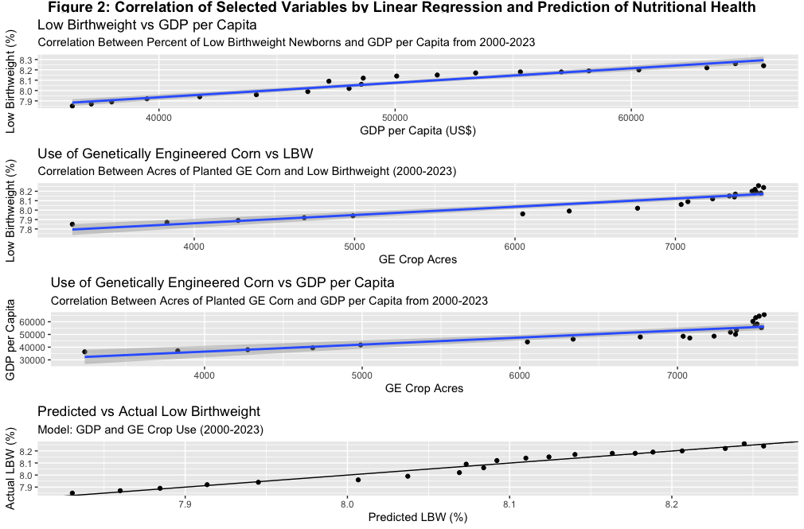

```{r setup, include=FALSE}
knitr::opts_chunk$set()
library(tidyverse)
library(car)
library(ggplot2)
library(tidyr)
library(lattice)
library(grid)
library(gridExtra)
library(ggsci)
```

## Introduction:


2008 was a period of significant financial hardship for many. After a large peak in the housing economy, mortgage related financial assets strained the global market. Starting in December 2007, there was a large and progressive market crash that later became known as the "Great Recession". It was the largest drop in gross domestic product (GDP) since World War II (Wienberg).

Although the market started to recover around mid 2009, improvement was slow leaving lasting impacts on today's society (Wienberg). In this project I aimed to explore some of those those remaining changes and the factors that interacted to produce them. Using data collected from both the the USDA and the World Bank I will be examining how genetically engineered (GE) corn use and nutritional outcomes were impacted by this crisis.

GE corn posed many advantages especially during this time as the mutations made to the crop protects it from insect and pest damage (USDA). We hypothesize that, given the state of the economy at the time, 2008 will mark a period of change that negatively impacted nutritional outcomes and increased the use of GE corn.

## Tidying and Statistical Tests:

Datasets from the World Bank and the USDA required significant tidying to reach the goals of this study. USDA data was divided by state and required consolidation to represent the whole US, and the World Bank data needed to be pruned significantly to only the things that mattered to this study which were:

| Variable                                 | Abbreviation | Why we care                                                                                                                                   |
|-------------------------|------------|-----------------------------------|
| Year                                     | NA           | For mapping and comparing over time                                                                                                           |
| Country Code                             | NA           | For joining data sets effectively                                                                                                             |
| GDP per capita (current US\$)            | gdp          | Broadly indicative of economic state in the US (World Bank)                                                                                   |
| Low-birthweight babies (% of births)     | lbw          | Representative of nutritional quality in a country. As % increases it represents decrease in nutrition outcomes for a population (World Bank) |
| Total Acres of Planted GE Corn in the US | us_ge_total  | Acres of land utilized for GE Corn specificially (USDA)                                                                                       |

### Tidying Methods

```{r warning=FALSE}
#reading in data
BiotechCropsAllTables2024 <- read_csv("BiotechCropsAllTables2024.csv", col_types = cols(Value = col_double()))
WORLD_BANK_DATA <- read_csv("WORLD BANK DATA.csv", col_types = cols(
  `2000 [YR2000]` = col_double(),
  `2021 [YR2021]` = col_double(),
  `2022 [YR2022]` = col_double(),
  `2023 [YR2023]` = col_double(),
  `2024 [YR2024]` = col_double()))
```

```{r echo=TRUE, warning=FALSE}
# Tidy GE DATA
condensed_ge_crops <- BiotechCropsAllTables2024|>
  group_by(`State`,`Year`)|>
  summarise(total_value_ge = sum(Value, na.rm = TRUE))|>
  mutate(`Country Code` = "USA")|>
  filter(`State` != "United States")|>
  pivot_wider(
    names_from = `State`,
    values_from = `total_value_ge`)|>
    mutate(us_ge_total = rowSums(across(
      c(`Alabama`, `Arkansas`, `California`, `Georgia`, `Illinois`, `Indiana`, `Iowa`,
        `Kansas`,`Louisiana`,`Michigan`, `Minnesota`, `Mississippi`, `Missouri`,`Nebraska`, `North Carolina`,
        `North Dakota`,`Ohio`,`Other States`, `South Dakota`, `Tennessee`, `Texas`, `Wisconsin`)), na.rm = TRUE))

# Tidy World Bank data
nutrition_gdp_data <- WORLD_BANK_DATA |>
  filter(`Series Name` %in% c("GDP per capita (current US$)", "Low-birthweight babies (% of births)")) |>
  select(`Series Name`, `Country Code`, `2000 [YR2000]`:`2024 [YR2024]`) |>
  pivot_longer(cols = `2000 [YR2000]`:`2024 [YR2024]`, names_to = "Year") |>
  mutate(Year = as.integer(str_extract(Year, "\\d{4}"))) |>
  pivot_wider(names_from = `Series Name`, values_from = value) |>
  rename(gdp = "GDP per capita (current US$)", lbw = "Low-birthweight babies (% of births)")

# Join datasets
joined_ge_gdp_nut <- right_join(condensed_ge_crops, nutrition_gdp_data, by = c("Country Code", "Year"))
condensed_df_final_proj <- joined_ge_gdp_nut |>
  select(-c(`Alabama`, `Arkansas`, `California`, `Georgia`, `Illinois`, `Indiana`, `Iowa`, `Kansas`, `Louisiana`,
            `Michigan`, `Minnesota`, `Mississippi`, `Missouri`, `Nebraska`, `North Carolina`, `North Dakota`,
            `Ohio`,`Other States`, `South Dakota`, `Tennessee`, `Texas`, `Wisconsin`)) |>
  filter(!is.na(lbw), !is.na(gdp), !is.na(us_ge_total))

```

After loading the required packages and reading in the data sets, the GE crop data was first tidied by

1.  Grouping by State and Year
2.  Creating a total count of GE acres for each county from each state
3.  Creating the variable country code in the data set
4.  Filtering out unnecessary variables
5.  Pivoting the Data set to a wide format making a column for each state
6.  Creating a comprehensive sum for each year encompassing the totals from each state

The World Bank data was then:

1.  Filtered to the metrics of interest (Low Birth Weight percent, GDP)
2.  Selecting desired columns including aforementioned metrics, country code, and year
3.  creating an integer variable from the existing year column
4.  Pivoting wide to separate out LBW and GDP
5.  renaming metrics of interest for ease of analysis

These data sets were then joined by country code and year, as well as cleaned to produce the initial working data frame. Later modifications were made such as separation by time period were performed when necessary for analysis.

### Statistical Testing

#### Regression Modeling

```{r echo=TRUE, warning=FALSE}
# Linear models
#low birth weight percent and GDP
gdp_bw_model <- lm(lbw ~ gdp, data = na.omit(condensed_df_final_proj))
summary(gdp_bw_model)
#GE use and GDP
gdp_ge_model <- lm(us_ge_total ~ gdp, data = na.omit(condensed_df_final_proj))
summary(gdp_ge_model)
#GE use and low birth weight percent
ge_bw_model <- lm(lbw ~ us_ge_total, data = na.omit(condensed_df_final_proj))
summary(ge_bw_model)
#GE use and low birth weight percent
model_full <- lm(lbw ~ gdp + us_ge_total, data = na.omit(condensed_df_final_proj))
summary(model_full)
#co linearity check
vif(model_full)

# Prediction of LBW% Based on GDP and GE Use
condensed_df_final_proj$lbw_proj <- predict(model_full, newdata = condensed_df_final_proj)

```

In this project, linear regression was chosen given the limited sample size of 23 years and the relatively simple nature of the model. This made it so both conclusions about the greater relationship between each individual variable and their impact on nutrition could be drawn. Notable statistics from this type of modeling include:\

| Value                           | What it tells us                                                                                                                  |
|-------------------------|-----------------------------------------------|
| Coefficients                    | the effect of the relationship. What does it actually look like (positive or negative, large or small)                            |
| P-Value                         | statistical significance of the relationship                                                                                      |
| R squared                       |  fit to the line or how much outcome variation the model accounts for                                                             |
| F-Statistic                     | Compares variances between more than two groups telling us if the model is improved with predictors                               |
| Variance Inflation Factor (VIF) | Is multicolinearity present. Are the independent variables actually also related?This can negatively impact the model if present. |

#### Pairwise Analysis by T-Test

```{r echo=TRUE, warning=FALSE}
# Divide data by year
pre2008_data <- condensed_df_final_proj |> 
  filter(Year < 2008) |> 
  rename(pre2008gdp = gdp, pre2008lbw = lbw, pre2008ge = us_ge_total)|>
  select(-`lbw_proj`)

post2008_data <- condensed_df_final_proj |> 
  filter(Year > 2008) |> 
  rename(post2008gdp = gdp, post2008lbw = lbw, post2008ge = us_ge_total)|>
  select(-`lbw_proj`)

final_proj_df_divided <- full_join(pre2008_data, post2008_data,by = c("Year", "Country Code"))
# T-tests for GDP, LBW, and GE use
t.test(final_proj_df_divided$pre2008gdp, final_proj_df_divided$post2008gdp) #GDP pre and post 2008
t.test(final_proj_df_divided$pre2008lbw, final_proj_df_divided$post2008lbw) #LBW % pre and post 2008
t.test(final_proj_df_divided$pre2008ge, final_proj_df_divided$post2008ge) #GE use pre and post 2008

# Bar plot preparation
barplot_df <- bind_rows(pre2008_data,post2008_data)
# Mean GDP
gdp_plot_df <- data.frame(
  period = c("Pre-2008", "Post-2008"),
  mean = c(
    mean(pre2008_data$pre2008gdp, na.rm = TRUE),
    mean(post2008_data$post2008gdp, na.rm = TRUE)))
# Mean GE crop use
ge_plot_df <- data.frame(
  period = c("Pre-2008", "Post-2008"),
  mean = c(
    mean(pre2008_data$pre2008ge, na.rm = TRUE),
    mean(post2008_data$post2008ge, na.rm = TRUE)))
# Mean Low Birthweight %
lbw_plot_df <- data.frame(
  period = c("Pre-2008", "Post-2008"),
  mean = c(
    mean(pre2008_data$pre2008lbw, na.rm = TRUE),
    mean(post2008_data$post2008lbw, na.rm = TRUE)))
#reordering so pre 2008 is first on the graph
lbw_plot_df <- lbw_plot_df |>
  mutate(period = reorder(period, mean))
ge_plot_df <- ge_plot_df |>
  mutate(period = reorder(period, mean))
gdp_plot_df <- gdp_plot_df |>
  mutate(period = reorder(period, mean))

```

T tests were additionally conducted to compare between selected metrics (GE use, GDP, and LBW %) before and after 2008. This would help develop our understanding of how these factors were specifically impacted in a historical context. Important statistics we will use here are the p-value or level of significance of the difference in means between the years and the actual percent difference exhibited between the groups.

```{r message=FALSE, warning=FALSE, include=FALSE}
# Plotting
#financial timeline
GDP_TIME <- ggplot(condensed_df_final_proj, aes(x = Year, y = gdp)) +
  geom_line() +
  geom_point() +
  labs(
    title = "Figure 1: GDP Timeline", 
    subtitle = "GDP per Capita by Year (2000-2023)", 
    x = "Year", 
    y = "GDP Value (per capita)") 

#Regression Plots
gdp_bw_regression <- ggplot(condensed_df_final_proj, aes(x = gdp, y = lbw)) +
  geom_point() +
  geom_smooth(method = "lm", se = TRUE) +
  labs(
    title = "Low Birthweight vs GDP per Capita", 
    subtitle = "Correlation Between Percent of Low Birthweight Newborns and GDP per Capita from 2000-2023", 
    x = "GDP per Capita (US$)", 
    y = "Low Birthweight (%)") 

ge_bw_regression <- ggplot(condensed_df_final_proj, aes(x = us_ge_total, y = lbw)) +
  geom_point() +
  geom_smooth(method = "lm", se = TRUE) +
  labs(
    title = "Use of Genetically Engineered Corn vs LBW", 
    subtitle = "Correlation Between Acres of Planted GE Corn and Low Birthweight (2000-2023)", 
    x = "GE Crop Acres", 
    y = "Low Birthweight (%)")

ge_gdp_regression <- ggplot(condensed_df_final_proj, aes(x = us_ge_total, y = gdp)) +
  geom_point() +
  geom_smooth(method = "lm", se = TRUE) +
  labs(
    title = "Use of Genetically Engineered Corn vs GDP per Capita", 
    subtitle = "Correlation Between Acres of Planted GE Corn and GDP per Capita from 2000-2023", 
    x = "GE Crop Acres", 
    y = "GDP per Capita")

lbw_pred_regression <- ggplot(condensed_df_final_proj, aes(x = lbw_proj, y = lbw)) +
  geom_point() +
  geom_abline(slope = 1, intercept = 0) +
  labs(
    title = "Predicted vs Actual Low Birthweight", 
    subtitle = "Model: GDP and GE Crop Use (2000-2023)", 
    x = "Predicted LBW (%)", 
    y = "Actual LBW (%)") 

#Bar Plots of Pre Versus Post 2008
gdp_plot <- ggplot(gdp_plot_df, 
  aes(x = reorder(period, + mean), y = mean)) +
  geom_bar(stat = "identity") +
  labs(
    title = "GDP Per Capita by Time Period",
    subtitle = "GDP Per Capita Pre vs. Post 2008",
    x = "Period",
    y = "GDP Per Capita") 

ge_plot <- ggplot(ge_plot_df, 
  aes(x = reorder(period, + mean), y = mean)) +
  geom_bar(stat = "identity") +
  labs(
    title = "Mean Number of GE Crop Acres Per Year by Time Period",
    subtitle = "Number of GE Crop Acres Per Year Pre vs. Post 2008",
    x = "Period",
    y = "GE Crop Acres") 

lbw_plot <- ggplot(lbw_plot_df, 
  aes(x = period, y = mean)) +
  geom_bar(stat = "identity") +
  labs(
    title = "Mean Low Birthweight Percentage by Time Period",
    subtitle = "Mean LBW % Pre vs. Post 2008",
    x = "Period",
    y = "Low Birthweight (%)") 
```

### Visualization:

#### Timeline of GDP:

This visualization was produced to illustrate the dip in GDP per capita that occurred in 2008

#### Significant Relationships Revealed by Regression Modeling:

Significant relationships revealed by linear regression were plotted in a scatter plot including a line of best fit. This allowed for the relationship to not only be numerically apparent but visually clear.

#### Comparisons Pre-2008 vs Post 2008:

Visualizing these comparisons allows for their relationship to be easily interpreted by a diversity of groups (both people trained in statistics and not). This kind of visualization for pairwise analysis can powerfully support any observable difference between two groups.

## Results:

### Correlation of Low Birthweight, Use of Genetically Engineered Corn, and GDP



Through linear regression, it was found that all initial comparisons were statistically significant. However there are important caveats to this that need to be considered.

#### GDP and Low Birth Weight

This finding was significant (β = 0.00008753, p = 1.23e-09) but the actual effect (coefficient) was low. This indicates that although the two variables GDP and LBW% are related their effect on each other was close to zero.

#### GDP and GE Crop Use

This finding exhibited a significant and higher coefficient than the other models (β = 0.13263, p \< 0.001). This is indicates that for each unit increase in GDP per capita the amount of acerage used for GE crops increases by the 0.13 acres. The adjusted r squared of 0.7193 also indicated a good fit to the model.

#### GE Crop Use and Low Birth Weight

This finding was significant (β = 0.00008753, p \< 0.001) but the actual effect (coefficient) was low. This again illustrates that while the relationship between the variables is present in the data, there is no evidence that they actually effect each other.

#### Impact of GDP and GE Crop Use on Low Birth Wright

Although both predictors in this multiple regression model, GDP (β = 0.00000899, p = 1.24e-06) and GE crop use (β = 0.00003782, p = 0.000205), were statistically significant the actual coefficients of these values were close to zero. This small magnitude indicates again that this relationship may be mediated through greater factors, not just the two tested here. The VIF of 3.75 also indicated a moderate degree of multicollinearity to an extent that is below the level of concern (5-10). This indicates our two variables GDP and GE crop use are not interfering with eachother

```{r message=FALSE, warning=TRUE, include=FALSE}
title_text_2 <- textGrob("Figure 2: Correlation of Selected Variables by Linear Regression and Prediction of Nutritional Health", gp = gpar(fontsize = 14, fontface = "bold"))
gdp_plot_rm_grob <- ggplotGrob(gdp_bw_regression + scale_fill_npg())
ge_plot_rm_grob  <- ggplotGrob(ge_bw_regression + scale_fill_npg())
gd_plot_npg_grob <- ggplotGrob(ge_gdp_regression + scale_fill_npg())
lbw_plot_npg_grob <- ggplotGrob(lbw_pred_regression + scale_fill_npg())

figure2 <- arrangeGrob(
  title_text_2,
  gdp_plot_rm_grob,
  ge_plot_rm_grob,
  gd_plot_npg_grob,
  lbw_plot_npg_grob,
  ncol = 1,
  heights = c(0.1, 1, 1, 1,1 )
)
```

### Comparisons of Tested Variables Pre and Post 2008


```{r include=FALSE}
title_text_3 <- textGrob("Figure 3: Comparing GDP, Low Birth Weight Percentage and Use of Geneically Engineered Corn Pre and Post 2008 ",
                         gp = gpar(fontsize = 14, fontface = "bold"))
gdp_plot_grob <- ggplotGrob(gdp_plot + scale_fill_npg())
ge_plot_grob  <- ggplotGrob(ge_plot + scale_fill_npg())
lbw_plot_grob <- ggplotGrob(lbw_plot + scale_fill_npg())

figure3 <- arrangeGrob(
  title_text_3,
  gdp_plot_grob,
  ge_plot_grob,
  lbw_plot_grob,
  ncol = 1,
  heights = c(0.1, 1, 1, 1)
)
```

After performing pairwise analysis by a t test we found out that each of the tested variables GE Usage (+47.637540%, p = 0.001004) GDP per capita (+35.928791%, p = 7.006e-06), and low birth weight (+ 3.131564%, p = 1.961e-07) all experienced increases after 2008.

## Conclusion:

### Findings:

While the majority of the regression models in this project were highly significant in the variables relationship to each other, the only one with an effect larger than 0.0001 was the relationship between the use of GEs and GDP. These showed a positive linear relationship to each other with a good r squared value indicating it accounted for 72% of the variance exhibited by the data. This may indicate that GDP increase could be a predictor of the continued innovation and increased availability of GEs.

Despite increases in GDP per capita after 2008, the percentage of underweight newborns and the use of GEs both increased. The increase in GEs was consistent with our hypothesis, but may also be a result of the increased access to genetic modification tools over the last two decades.

We correctly predicted an increase in low birth weight percentage concurrent with our hypothesis that economic downturn would result in poorer nutritional outcomes. However the magnitude of this change was small and could be attributed to other socioeconomic or environmental factors such as increasingly common exposure to pollutants.

### Limitations:

Further studies should include a wider range of dates so other predictive methods such as logistic regression or decision trees can be used to predict outcomes like low birth weight. While our model revealed interesting trends it is clear a more robust system of modeling these factors is needed to make any definitive conclusions.

## Works Cited:

USDA. (n.d.). *Adoption of genetically engineered crops in the United States - documentation*. Adoption of Genetically Engineered Crops in the United States - Documentation \| Economic Research Service. <https://www.ers.usda.gov/data-products/adoption-of-genetically-engineered-crops-in-the-united-states/documentation>

Weinberg, J. (n.d.). *The great recession and its aftermath*. Federal Reserve History. <https://www.federalreservehistory.org/essays/great-recession-and-its-aftermath>

World Bank. (n.d.). *World Bank Data*. Data Catalog. <https://datacatalog.worldbank.org/home>
